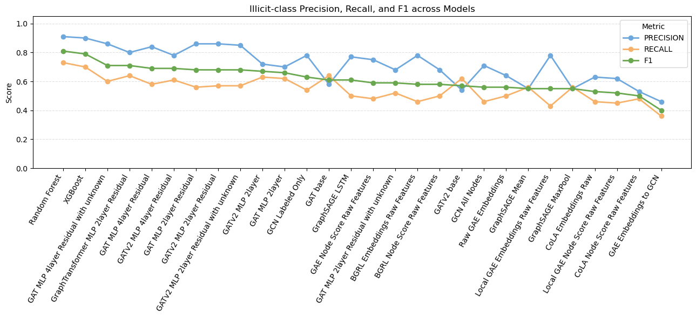
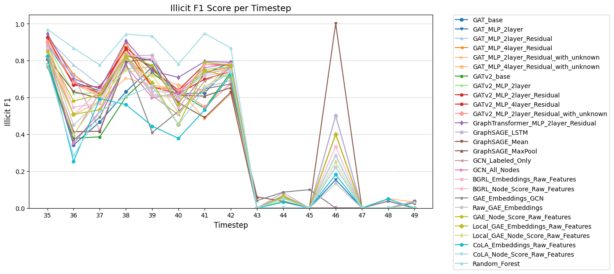

# Bitcoin Fraud Detection with the Elliptic Dataset
## CS5284 Project

**Team Members:** Li Jiayi, Russell Loh Chun Fa, Zhang Jiazheng

---

# Agenda

1. **Introduction and Motivation**
2. **Dataset Exploration and Analysis**
   - Dataset Overview
   - Key Data Observations
3. **Methodology and Experiments**
   - Train-Test Split
   - Traditional Machine Learning Models
   - Graph Neural Networks
   - Self-Supervised Learning Approaches
4. **Results and Discussion**
   <!-- - Performance Comparison
   - Model Analysis
   - Temporal Evaluation -->
5. **Conclusion and Future Work**

---

# Introduction & Motivation

**The Problem:**
- Criminals use complex, multi-step transactions for money laundering in Bitcoin
- Fraud detection is challenging due to data imbalance and criminals try to obscure transaction paths

**Motivation to Explore Graph Fraud Detection**
- Bitcoin transactions form a **graph network**
- GNNs can leverage both node features and network structure
- Potential to capture money laundering chains and patterns

**Our Goal:**
Build classification models to predict **licit** vs **illicit** transactions using Real Bitcoin data from Elliptic (MIT, IBM, Elliptic), leveraging:
- Node features (transaction characteristics) 
- Graph structure (network topology)

---

# Dataset

---

# Dataset Overview

**Real Bitcoin transaction data over ~1 year (49 time steps)**

| Component | Details |
|-----------|---------|
| **Nodes** | 203,769 transactions |
| **Edges** | 234,355 directed payment flows |
| **Features** | 166 per transaction (94 local features, 72 aggregated features from 1 hop neighbors) |
| **Labels** | '1' = Illicit, '2' = Licit, 'unknown' |

Each timestep forms a graph component, there is no connection between different timesteps.

**Major Challenges:**
- Severe class imbalance
- 77% unlabeled data
- Temporal dynamics

---

# Key Observation 1: Class Imbalance

| Class | Count | Percentage |
|-------|-------|------------|
| Unknown | 157,205 | **77.1%** |
| Licit (2) | 42,019 | 20.6% |
| Illicit (1) | 4,545 | **2.3%** |

**Implications:**
- Extreme imbalance: ~4,500 illicit vs ~42,000 licit
- Must effectively utilize unlabeled data
- Need careful evaluation metrics (F1-score, not just accuracy)

---

# Key Observation 2: Temporal Dynamics

**Irregular fraud patterns across time steps:**
- Fraud occurs in organized bursts, not steady background activity
- **Critical event at time step 43:** Major dark market closure
- Fundamentally changed fraud patterns post-closure

---

# Key Observation 3: Network Structure

**Scale-Free Network:**
- Most transactions have few connections
- Few massive "hub" nodes (exchanges, large wallets)
- Power-law degree distribution

---

# Key Observation 4: Structural Differences

**Licit vs Illicit Transaction Networks:**

1. **Fragmentation:** Licit = dense clusters, Illicit = long chains + fragments
2. **Money laundering chains:** Long linear paths to obfuscate source
3. **Local isolation:** Illicit nodes have fewer immediate neighbors

---

# Methodology

---

# Experiment Set Up
## Train Test Split: Temporal Split

1. **Avoid data leakage** - random split leaks future info
2. **Real-world deployment** - models must predict future fraud
3. **Follow original paper** (Weber et al. 2019)

| Split | Time Steps | Nodes | Labeled | Edges |
|-------|------------|-------|---------|-------|
| **Train** | 1-34 | 136,265 | 29,894 | 156,843 |
| **Test** | 35-49 | 67,504 | 16,670 | 77,512 |

**No validation set:** Limited data + time step 43 market event

## Evaluation Metric
Precision, Recall, F1 on Illicit class

---

# Approaches Overview

## Model Categories Explored

| Category | Models |
|----------|--------|
| **Traditional ML** | Random Forest, XGBoost |
| **Graph Neural Networks** | GCN, GraphSAGE, GAT, GATv2, Graph Transformer |
| **Self-Supervised Learning** | BGRL+GCN, GAE+GCN, Local GAE+GCN, CoLA+GCN |

## Training Scenarios
- **Labeled only:** Train on ~30K labeled nodes (clean training)
- **With unknown:** Train on full dataset (~106K nodes, semi-supervised)

---

# Approaches: Traditional ML

**XGBoost** 
- Gradient boosting framework
- Sequential error correction

**Random Forest**
- Ensemble of decision trees
- Uses only node features (no graph structure)

**Results - Best Performing Models:**

| Model | Precision | Recall | **F1** |Before t43 | After t43 |
|-------|-----------|--------|--------|--------|--------|
| **Random Forest** | 0.91 | 0.73 | **0.81** |0.9016|0.029|
| **XGBoost** | 0.90 | 0.70 | **0.79** |0.87|0.05|

**Key Finding:** Traditional ML achieves the highest performance, outperforming all GNN and SSL methods

---

# GNN Approach 1: Graph Convolutional Network (GCN)

**Elliptic Benchmark Reproduction:** Our vanilla GCN mirrors the original paper setup

**Architecture:** **2-layer GraphConv** with embedding_dim = 100 Designed to replicate benchmark results

**Training Settings:**
- **Optimizer:** Adam (lr=1e-3, weight decay=5e-4)
- **Class weights & Loss:** CrossEntropy Loss with [0.7, 0.3] weigtht to counter licit/illicit imbalance
- **Training:** 1,500 epochs, early stopping after 20 stagnant checkpoints

**Two Training Regimes:**

| Training Mode | Precision | Recall | **F1** | Before t43 | After t43 |
|---------------|-----------|--------|--------|------------|-----------|
| **Labeled only** | 0.78 | 0.54 | **0.63** | 0.72 | 0.00 |
| **All nodes** | 0.71 | 0.46 | **0.56** | 0.72 | 0.01 |

**Key Finding:** Labeled-only training outperforms semi-supervised approach

---

# GNN Approach 2: GraphSAGE

**Core Idea:** Sample fixed-size neighborhoods and aggregate with learnable functions; Samples $u$ neighbors (with replacement if needed); aggregators learn different patterns
<!-- 
$$\mathbf{h}_i^{(l+1)} = \sigma\left(\mathbf{W} \cdot \text{CONCAT}\left(\mathbf{h}_i^{(l)}, \text{AGG}\left(\{\mathbf{h}_j^{(l)}, j \in \mathcal{N}_{\text{sample}}(i)\}\right)\right)\right)$$ -->

**Architecture & Training Set ups:**
- Sample size = 2, Multiple aggregators: Mean, MaxPool, LSTM; 2 layers, 500 epochs

**Results:**

| Aggregator | Precision | Recall | **F1** | Before t43 | After t43 |
|------------|-----------|--------|--------|------------|-----------|
| **LSTM** | 0.77 | 0.50 | **0.61** | 0.70 | 0.08 |
| Mean | 0.55 | 0.56 | **0.55** | 0.65 | 0.12 |
| MaxPool | 0.55 | 0.56 | **0.55** | 0.63 | 0.05 |

**Key findings:** 
- Did not observe improvement compared to GCN
- LSTM aggregator performs best overall (F1 = 0.61); Mean aggregator shows highest post-closure resilience

---

# GNN Approach 3: Graph Attention Networks (GAT)

**Core Idea:** Learn attention weights to determine neighbor importance
- Adaptive neighbor weighting instead of fixed aggregation
- Multi-head attention captures different relationship aspects

**GAT vs GATv2:**
- **GAT (v1):** Original attention mechanism with shared weight matrix
- **GATv2:** Improved version with dynamic attention computation
- **Key difference:** GATv2 applies attention after weight transformation for better expressiveness

**Architecture Variants Tested:**
- Base models, 2-layer, 4-layer configurations
- With/without residual connections and MLP classifiers
- Both labeled-only and semi-supervised training

---

# GAT Results: Comprehensive Comparison

| Model | With/Without Unknown | Precision | Recall | **F1** | Before t43 | After t43 |
|-------|---------------------|-----------|--------|--------|------------|-----------|
| GAT Base | Without | 0.58 | 0.64 | **0.61** | 0.69 | 0.01 |
| GAT 2L (MLP) | Without | 0.70 | 0.62 | **0.66** | 0.77 | 0.01 |
| GAT 2L + Residual | Without | 0.86 | 0.56 | **0.68** | 0.77 | 0.01 |
| **GAT 4L + Residual** | **Without** | **0.84** | **0.58** | **0.69** | **0.78** | **0.02** |
| GATv2 Base | Without | 0.54 | 0.62 | **0.57** | 0.65 | 0.00 |
| GATv2 2L (MLP) | Without | 0.72 | 0.63 | **0.67** | 0.76 | 0.02 |
| GATv2 2L + Residual | Without | 0.86 | 0.57 | **0.68** | 0.77 | 0.00 |
| **GATv2 4L + Residual** | **Without** | **0.78** | **0.61** | **0.69** | **0.79** | **0.02** |
| GAT 2L + Residual | With Unknown | 0.68 | 0.52 | **0.59** | 0.67 | 0.02 |
| **GAT 4L + Residual** | **With Unknown** | **0.86** | **0.60** | **0.71** | **0.77** | **0.01** |
| GATv2 2L + Residual | With Unknown | 0.85 | 0.57 | **0.68** | 0.72 | 0.02 |

---

# GAT Analysis: Key Observations

**GAT vs GATv2 Performance:**
- **GAT slightly outperforms GATv2** in most configurations; both show similar patterns across architecturals
- **Best overall:** GAT 4L + Residual (semi-supervised) = F1 0.71

**Architectural Insights:**
- **4-layer > 2-layer:** Deeper networks capture more complex patterns
- **Residual connections:** Essential for preventing degradation in deeper networks
- **MLP classifier:** Better than linear head for final classification

**Training Strategy Comparison:**
- **Semi-supervised wins:** Including unknown nodes improves best model (0.69 → 0.71)
- **But mixed results:** Some models perform worse with unknowns (label noise effect)
- **Trade-off:** More data vs potential noise from unlabeled nodes

**Temporal Robustness:** All models collapse after t43 (dark market closure)

---

# GNN Approach 4: Graph Transformer

**Core Idea:** Apply transformer's scaled dot-product attention to graph structure

$$\text{Attention}(\mathbf{Q}, \mathbf{K}, \mathbf{V}) = \text{softmax}\left(\frac{\mathbf{Q}\mathbf{K}^T}{\sqrt{d_k}}\right)\mathbf{V}$$

<!-- where $\mathbf{Q} = \mathbf{W}_Q\mathbf{h}_i$, $\mathbf{K} = \mathbf{W}_K\mathbf{h}_j$, $\mathbf{V} = \mathbf{W}_V\mathbf{h}_j$ -->

Separate Q/K/V projections provide more expressiveness than GAT; captures longer-range dependencies

**Architecture:** Multi-head (8 heads × 16 dims), 2 layers with residuals

**Results:**

| Model | Precision | Recall | **F1** | Before t43 | After t43 |
|-------|-----------|--------|--------|------------|-----------|
| **Graph Transformer 2L** | 0.80 | 0.64 | **0.71** | 0.82 | 0.01 |

**Key finding:**
- Best overall GNN performance (F1 = 0.71)
- Strong before market closure (F1 = 0.82)
- Transformer architecture captures long-range dependencies effectively

---

# Approaches: Self-Supervised Learning

**Challenge:** Only 23% of data is labeled (77% unlabeled) - can we leverage unlabeled nodes?

**Strategy:** Pre-train on full graph → Transfer knowledge to supervised classifier

**Methods Explored:**

| Method | Core Idea | Architecture |
|--------|-----------|-------------|
| **BGRL** (Bootstrapped Graph Latents) | Uses interacting online/target encoders with augmentation | Momentum-based contrastive learning |
| **Graph Autoencoder (GAE)** | Reconstruction-based anomaly detection | Global and Local subgraph variants |
| **CoLA** (Contrastive Learning for Anomalies) | Maximizes agreement between target nodes and their local subgraphs | Contrastive discrimination |

**Transfer Strategies:** Embeddings concatenation, Node anomaly scores

---

# SSL Results: Comprehensive Comparison

**All SSL Variants vs GCN Baseline:**

| Method | Variant | Precision | Recall | **F1** | Before t43 | After t43 |
|--------|---------|-----------|--------|--------|------------|-----------|
| **GCN Baseline** | Labeled only | 0.78 | 0.54 | **0.63** | **0.72** | 0.00 |
| **BGRL** | Embeddings + Raw | 0.78 | 0.46 | **0.58** | **0.75** | 0.01 |
| | Node Score + Raw | 0.68 | 0.50 | **0.58** | **0.75** | 0.01 |
| **GAE** | Embeddings Only | 0.46 | 0.36 | **0.40** | **0.64** | 0.04 |
| | Raw + Embeddings | 0.64 | 0.50 | **0.56** | **0.73** | 0.00 |
| | Node Score + Raw | 0.75 | 0.48 | **0.59** | **0.77** | 0.02 |
| **Local GAE** | Embeddings + Raw | 0.78 | 0.43 | **0.55** | **0.71** | 0.02 |
| | Node Score + Raw | 0.62 | 0.45 | **0.52** | **0.70** | 0.02 |
| **CoLA** | Embeddings + Raw | 0.63 | 0.46 | **0.53** | **0.62** | 0.02 |
| | Node Score + Raw | 0.53 | 0.48 | **0.50** | **0.65** | 0.01 |

**Best SSL:** GAE Node Score (F1 = 0.59, Before t43 = 0.77) vs **GCN Baseline (F1 = 0.63, Before t43 = 0.72)**

---

# SSL Analysis: Findings and Conclusions

**Performance Patterns:**
- **Improved Recall:** SSL methods generally increased recall (0.43-0.50) vs precision (0.46-0.78)
- **Underperformed Baseline:** None outperformed the purely supervised GCN baseline (F1 = 0.63)
- **Node Scores > Embeddings:** Anomaly scores consistently outperformed embedding concatenation

**Key Insights:**
1. **Best SSL Strategy:** GAE reconstruction error as anomaly features (F1 = 0.59, Before t43 = 0.77)
2. **Local vs Global:** Local subgraph methods sacrifice too much global context
3. **Contrastive Learning:** BGRL (0.58) > CoLA (0.53) for this task

**Critical Finding:**
Generic reconstruction tasks may **smooth embeddings too much**, blurring the sharp decision boundaries needed for rare illicit nodes. For Bitcoin fraud detection, **supervised learning with labeled data** provides clearer discriminative signals than self-supervised graph reconstruction methods

---

# Result Summary

---

# Overall Comparison

---
# Overall Compareison
| Approach | Model | With/Without Unknown | Overall F1 | Before t43 | After t43 |
|----------|-------|---------------------|------------|------------|-----------|
| **Traditional ML** | Random Forest | Without | **0.81** | **0.90** | 0.03 |
| | XGBoost | Without | **0.79** | **0.87** | 0.00 |
| **GNN** | GCN (Labeled) | Without | 0.63 | 0.72 | 0.00 |
| | GraphSAGE (LSTM) | Without | 0.61 | 0.70 | 0.08 |
| | GAT 4L + Residual | **With Unknown** | **0.71** | 0.77 | 0.01 |
| | GATv2 4L + Residual | Without | 0.69 | 0.79 | 0.02 |
| | **Graph Transformer 2L** | Without | **0.71** | **0.82** | 0.01 |
| **SSL** | BGRL (Best) | Without | 0.58 | 0.75 | 0.01 |
| | GAE (Node Score) | Without | **0.59** | **0.77** | 0.02 |
| | Local GAE (Embeddings) | Without | 0.55 | 0.71 | 0.02 |
| | CoLA (Embeddings) | Without | 0.53 | 0.62 | 0.02 |

---
# Key Insights: Why Traditional ML Wins

**Performance Hierarchy:**
- **Traditional ML (Random Forest):** F1 = 0.81 (highest overall)
- **Graph Transformer:** F1 = 0.71 (best GNN, strong pre-closure = 0.82)  
- **GAT 4L + Unknown:** F1 = 0.71 (marginal benefit from unknowns: 0.69 → 0.71)
- **Other GNNs:** F1 = 0.55-0.69 (diminishing returns)

**Why GNNs Underperform: Structural Limitations**
1. **Pre-aggregated features:** 72/166 features already capture 1-hop neighbor information, this implies the handcrafted features are powerful
2. **Graph destruction:** Unknown node removal breaks connectivity (77% unknowns)
3. **Unknown label noise:** 77% unlabeled data introduces training instability  
4. **Missing edge features:** Node-only information limits relational learning
5. **Sparse connectivity:** Low average degree (~2.3) limits message passing effectiveness
6. **Over-smoothing risk:** Multiple layers blur rare fraud signal boundaries

---

# Key Findings: Temporal Performance Drop

**Time Step 43 Market Event Impact:**

<!--  -->

**Catastrophic performance drop** at time step 43 across ALL models. Dark market closure fundamentally changed fraud patterns, models trained on pre-closure data cannot generalize. This reinforces the challenge for fraud detection and highlights critical need for continual learning / temporal adaptation

---

# Conclusion & Key Takeaways

**Main Contributions:**
1. ✅ Rigorous temporal split preventing data leakage
2. ✅ Comprehensive comparison across Traditional ML, GNN, and SSL approaches
3. ✅ Deep architectural exploration with 15+ model variants
4. ✅ Temporal analysis revealing catastrophic failure patterns

**Key Technical Findings:**
- **Feature engineering dominates:** Hand-crafted features (166D) capture fraud signals better than graph propagation
- **Attention mechanisms matter:** Adaptive neighbor weighting outperforms fixed aggregation schemes
- **SSL objectives misalign:** Generic reconstruction tasks don't capture fraud-specific decision boundaries
- **Graph structure helps selectively:** Benefits emerge only with sophisticated attention and residual connections
---
# Conclusion & Key Takeaways

**Critical Challenge - Temporal Robustness:**
- **Universal failure:** All models collapse after market regime change (97-100% performance drop)
- **Distribution shift vulnerability:** Static models cannot adapt to evolving fraud patterns
- **Label sparsity:** Post-closure fraud becomes too rare for reliable evaluation

---

# Future Work

**1. Temporal Adaptation & Robustness:**
- **Streaming graph models:** TGAT, TGN for explicit time encoding
- **Drift detection:** Online model updates with distribution shift monitoring
- **Continual learning:** Adapt to evolving fraud patterns without catastrophic forgetting

**2. Fraud-Specific SSL Objectives:**
- **Targeted pretraining:** Fraud-aware subgraph contrast, edge anomaly scoring
- **Masked graph autoencoders:** GraphMAE for better fraud signal preservation
- **Sharp decision boundaries:** SSL objectives aligned with rare anomaly detection

---
# Future Work
**3. Enhanced Graph Representations:**
- **Heterogeneous modeling:** Exchanges, mixers, smart contracts as distinct node types; Add edge features for better representation
- **Higher-order features:** Multi-hop flow patterns, temporal transaction chains
- **Domain adaptation:** Mitigate covariate shift across market regimes

**4. Practical Deployment Considerations:**
- **Active learning:** Selective labeling for post-shift scarce labels
- **Model recalibration:** Maintain prediction confidence under distribution changes
- **Real-time adaptation:** Online learning for dynamic financial markets

---

# Thank You!

**Team:** Li Jiayi, Russell Loh Chun Fa, Zhang Jiazheng

**Project:** Bitcoin Fraud Detection with Graph Neural Networks
